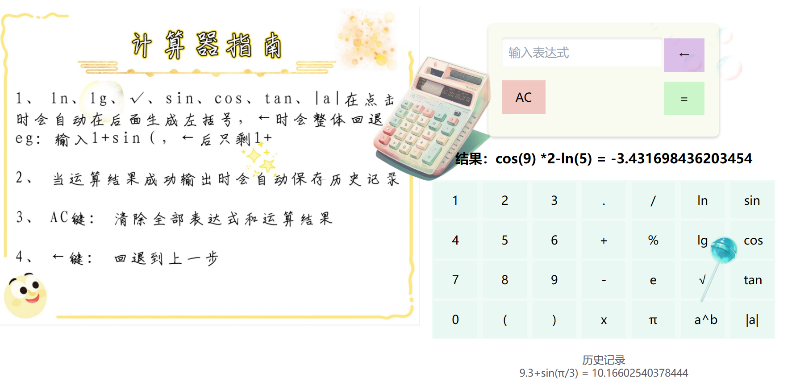
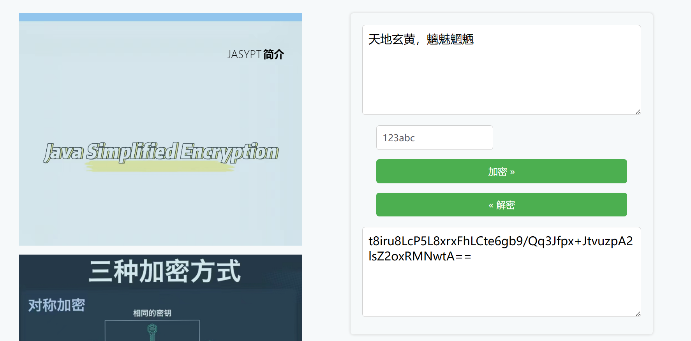
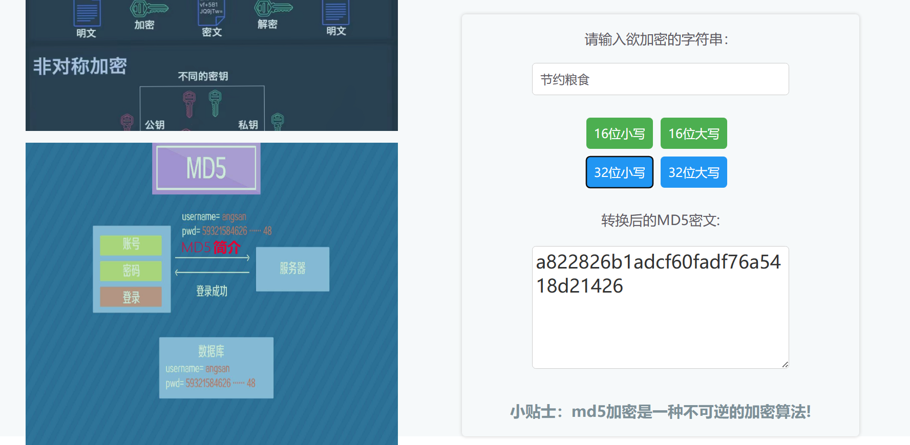
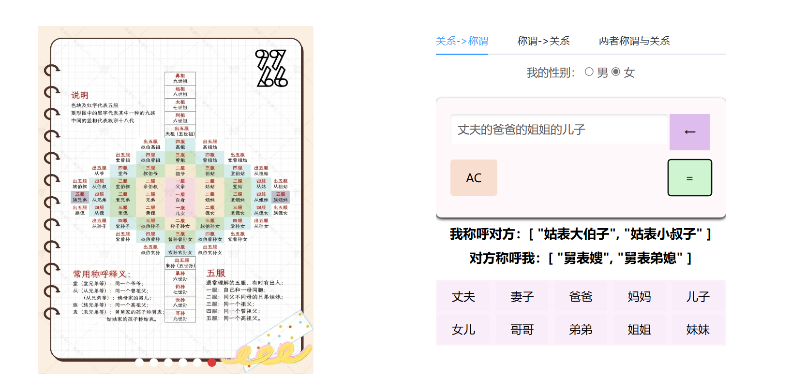
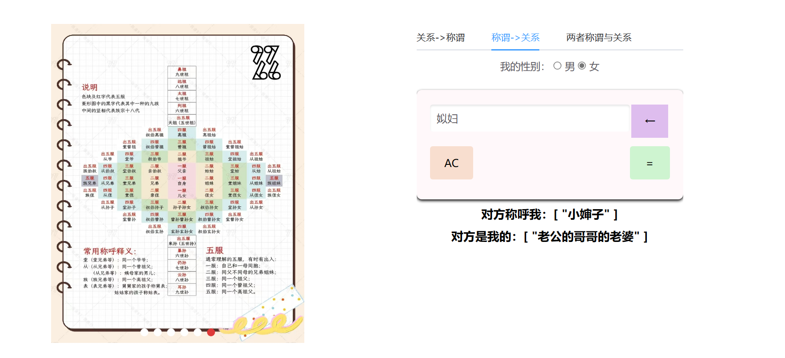
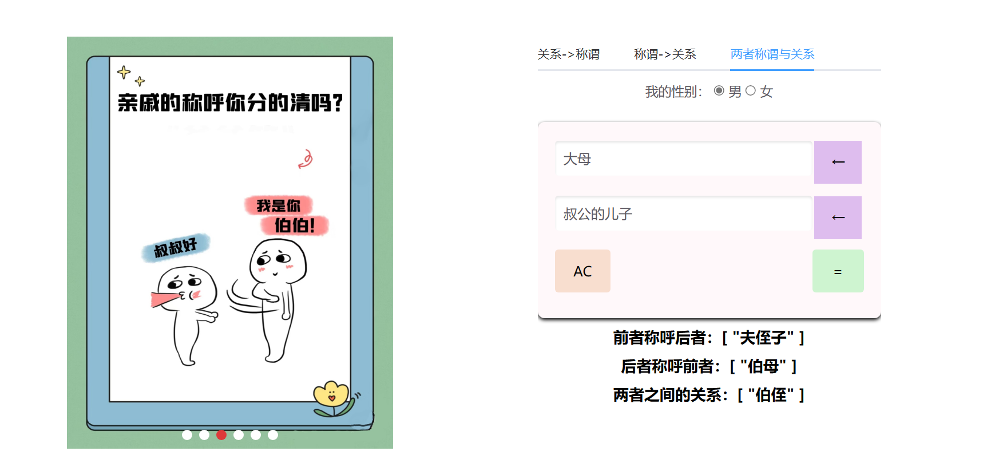

# Name: CalcuPro

## 1. 基础计算器

+ 实现基础的四则运算
+ 支持三角函数、绝对值、开平方、对数运算等
+ 可进行混合运算，通过括号改变运算顺序
+ 保留历史记录

示例：\

## 2. 汇率转换器

+ 支持汇率查询，涉及人民币、美元、欧元等二十多种货币之间的转换
+ 支持人民币金额的大小写转换

示例：\

## 3. JASYPT加/解密器

+ 支持对称加解密和MD5加密

示例：\

## 4. 称呼计算器

+ 支持关系找称谓、称谓找关系以及两者称谓与关系的计算
+ 支持古文式表达，如君姑、君舅、婿伯等
+ 可使用合称查询

示例：\

